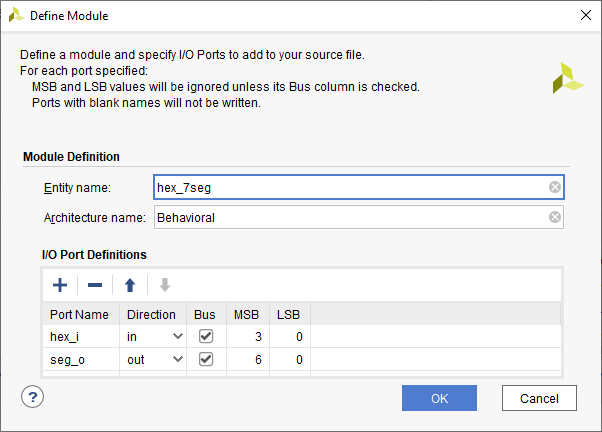
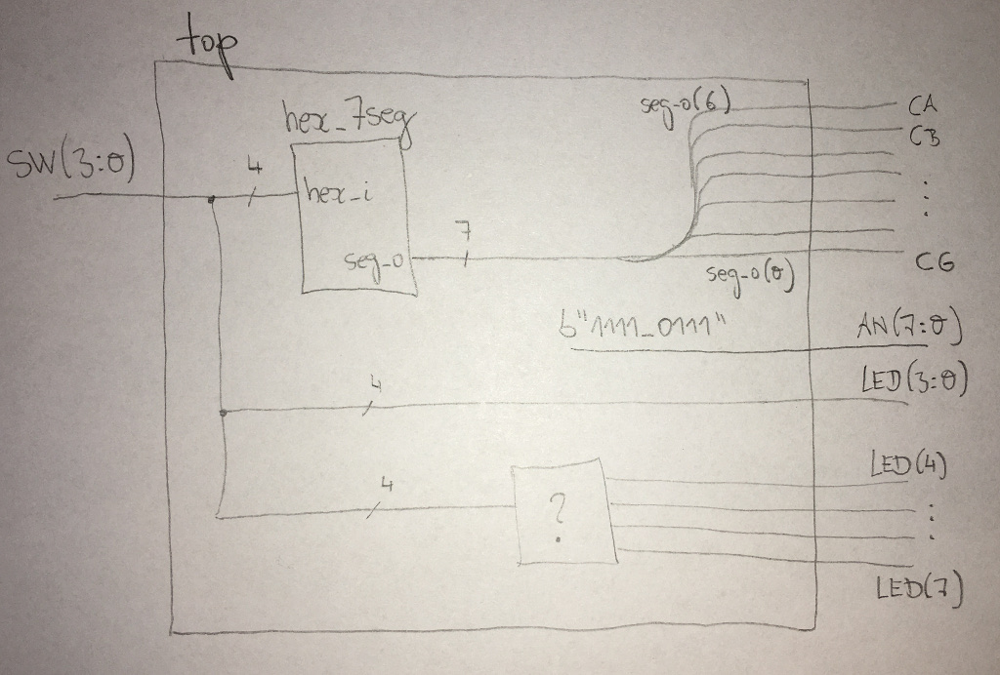

# Lab 4: Seven-segment display decoder

<!--

<p align="center">
  The Study of Modern and Developing Engineering BUT<br>
  CZ.02.2.69/0.0/0.0/18_056/0013325
</p>
-->


### Learning objectives

After completing this lab you will be able to:

* Use 7-segment display
* Use VHDL processes
* Understand the structural VHDL description

The purpose of this laboratory exercise is to design a 7-segment display decoder and to become familiar with the VHDL structural description that allows you to build a larger system from simpler or predesigned components.

### Table of contents

* [Preparation tasks](#preparation)
* [Part 1: Synchronize Git and create a new folder](#part1)
* [Part 2: VHDL code for seven-segment display decoder](#part2)
* [Part 3: Top level VHDL code](#part3)
* [Experiments on your own](#experiments)
* [Lab assignment](#assignment)
* [References](#references)

<a name="preparation"></a>

## Preparation tasks (done before the lab at home)

The Nexys A7 board provides two four-digit common anode seven-segment LED displays (configured to behave like a single eight-digit display).

1. See [schematic](https://github.com/tomas-fryza/digital-electronics-1/blob/master/Docs/nexys-a7-sch.pdf) or [reference manual](https://reference.digilentinc.com/reference/programmable-logic/nexys-a7/reference-manual) of the Nexys A7 board and find out the connection of 7-segment displays, ie to which FPGA pins are connected and how.

2. Complete the decoder truth table for **common anode** 7-segment display.

   | **Hex** | **Inputs** | **A** | **B** | **C** | **D** | **E** | **F** | **G** |
   | :-: | :-: | :-: | :-: | :-: | :-: | :-: | :-: | :-: |
   | 0 | 0000 | 0 | 0 | 0 | 0 | 0 | 0 | 1 |
   | 1 | 0001 | 1 | 0 | 0 | 1 | 1 | 1 | 1 |
   | 2 |      |   |   |   |   |   |   |   |
   | 3 |      |   |   |   |   |   |   |   |
   | 4 |      |   |   |   |   |   |   |   |
   | 5 |      |   |   |   |   |   |   |   |
   | 6 |      |   |   |   |   |   |   |   |
   | 7 |      |   |   |   |   |   |   |   |
   | 8 | 1000 | 0 | 0 | 0 | 0 | 0 | 0 | 0 |
   | 9 |      |   |   |   |   |   |   |   |
   | A |      |   |   |   |   |   |   |   |
   | b |      |   |   |   |   |   |   |   |
   | C |      |   |   |   |   |   |   |   |
   | d |      |   |   |   |   |   |   |   |
   | E | 1110 | 0 | 1 | 1 | 0 | 0 | 0 | 0 |
   | F | 1111 | 0 | 1 | 1 | 1 | 0 | 0 | 0 |

   

    > The image above was used from website: [How Seven Segment Display Works & Interface it with Arduino](https://lastminuteengineers.com/seven-segment-arduino-tutorial/).
    >

<a name="part1"></a>

## Part 1: Synchronize repositories and create a new folder

1. Run Git Bash (Windows) of Terminal (Linux), navigate to your working directory, and update local repository. Create a new working folder `labs/04-segment` for this laboratory exercise.

<a name="part2"></a>

## Part 2: VHDL code for seven-segment display decoder

1. Perform the following steps to simulate the seven-segment display decoder in Vivado.

   1. Create a new Vivado RTL project `display` in your `labs/04-segment` working folder.
   2. Create a VHDL source file `hex_7seg` for the decoder.
   3. Choose default board: `Nexys A7-50T`.
   4. Use **Define Module** dialog and define I/O ports of entity `hex_7seg` as follows.

   | **Port name** | **Direction** | **Type** | **Description** |
   | :-: | :-: | :-- | :-- |
   | `hex_i` | input   | `std_logic_vector(4 - 1 downto 0)` | Input binary data |
   | `seg_o` | output  | `std_logic_vector(7 - 1 downto 0)` | Cathode values in the order A, B, C, D, E, F, G |

   

   5. Use [combinational process](https://github.com/tomas-fryza/digital-electronics-1/wiki/Processes) and define an architecture of the decoder. Note that, the process below is "executed" only when `hex_i` value is changed. Inside a process, `case`-`when` [assignments](https://github.com/tomas-fryza/digital-electronics-1/wiki/Signal-assignments) can be used.

    ```vhdl
    ------------------------------------------------------------------------
    -- Architecture body for seven-segment display decoder
    ------------------------------------------------------------------------
    architecture Behavioral of hex_7seg is
    begin

        --------------------------------------------------------------------
        -- p_7seg_decoder:
        -- A combinational process for 7-segment display (Common Anode)
        -- decoder. Any time "hex_i" is changed, the process is "executed".
        -- Output pin seg_o(6) controls segment A, seg_o(5) segment B, etc.
        --       segment A
        --        | segment B
        --        |  | segment C
        --        +-+|  |   ...   segment G
        --          ||+-+          |
        --          |||            |
        -- seg_o = "0000001"-------+
        --------------------------------------------------------------------
        p_7seg_decoder : process(hex_i)
        begin
            case hex_i is
                when "0000" =>
                    seg_o <= "0000001";     -- 0
                when "0001" =>
                    seg_o <= "1001111";     -- 1


                -- WRITE YOUR CODE HERE
                -- 2, 3, 4, 5, 6, 7


                when "1000" =>
                    seg_o <= "0000000";     -- 8


                -- WRITE YOUR CODE HERE
                -- 9, A, b, C, d


                when "1110" =>
                    seg_o <= "0110000";     -- E
                when others =>
                    seg_o <= "0111000";     -- F
            end case;
        end process p_7seg_decoder;

    end architecture Behavioral;
    ```

   6. Create a VHDL [simulation source](https://www.edaplayground.com/x/Vdpu) `tb_hex_7seg` and verify the functionality of your decoder.

<a name="part3"></a>

## Part 3: Top level VHDL code

VHDL provides a mechanism how to build a larger system from simpler or predesigned components. It is called an instantiation. Each instantiation statement creates an instance (copy) of a design entity.

VHDL-93 and later offers two methods of instantiation: **direct instantiation** and **component instantiation**. In direct instantiation, the entity itself is directly instantiated in an architecture. Its ports are connected using the port map. Let the top-level design `top.vhd`, implements an instance of the module defined in `hex_7seg.vhd`.

1. Perform the following steps to implement the seven-segment display decoder on the Nexys A7 board.

   1. Create a new VHDL design source `top` in your project.
   2. Use **Define Module** dialog and define I/O ports of entity `top` as follows.

   | **Port name** | **Direction** | **Type** | **Description** |
   | :-: | :-: | :-- | :-- |
   | `SW` | in  | `std_logic_vector(4 - 1 downto 0)` | Input binary data |
   | `CA` | out | `std_logic` | Cathod A |
   | `CB` | out | `std_logic` | Cathod B |
   | `CC` | out | `std_logic` | Cathod C |
   | `CD` | out | `std_logic` | Cathod D |
   | `CE` | out | `std_logic` | Cathod E |
   | `CF` | out | `std_logic` | Cathod F |
   | `CG` | out | `std_logic` | Cathod G |
   | `AN` | out | `std_logic_vector(8 - 1 downto 0)` | Common anode signals to individual displays |
   | `LED` | out | `std_logic_vector(8 - 1 downto 0)` | LED indicators |

   3. Use [direct instantiation](https://github.com/tomas-fryza/digital-electronics-1/wiki/Direct-instantiation) and define an architecture of the top level.

    ```vhdl
    ------------------------------------------------------------------------
    -- Architecture body for top level
    ------------------------------------------------------------------------
    architecture Behavioral of top is
    begin

        --------------------------------------------------------------------
        -- Instance (copy) of hex_7seg entity
        hex2seg : entity work.hex_7seg
            port map(
                hex_i    => SW,
                seg_o(6) => CA,

                -- WRITE YOUR CODE HERE

                seg_o(0) => CG
            );

        -- Connect one common anode to 3.3V
        AN <= b"1111_0111";

        -- Display input value on LEDs
        LED(3 downto 0) <= SW;


        --------------------------------------------------------------------
        -- Experiments on your own: LED(7:4) indicators

        -- Turn LED(4) on if input value is equal to 0, ie "0000"
        -- WRITE YOUR CODE HERE

        -- Turn LED(5) on if input value is greater than "1001", ie 10, 11, 12, ...
        -- WRITE YOUR CODE HERE

        -- Turn LED(6) on if input value is odd, ie 1, 3, 5, ...
        -- WRITE YOUR CODE HERE

        -- Turn LED(7) on if input value is a power of two, ie 1, 2, 4, or 8
        -- WRITE YOUR CODE HERE

    end architecture Behavioral;
    ```

   

   4. Create a new [constraints XDC](https://github.com/Digilent/digilent-xdc/blob/master/Nexys-A7-50T-Master.xdc) file: `nexys-a7-50t` and uncomment used pins according to the `top` entity.
   5. Compile the project and download the generated bitstream `display/display.runs/impl_1/top.bit` into the FPGA chip.
   6. Test the functionality of the seven-segment display decoder by toggling the switches and observing the display and LEDs. Change the binary value `AN <= b"0111_1111"` and observe its effect on the display selection.
   7. Use **IMPLEMENTATION > Open Implemented Design > Schematic** to see the generated structure.

## Synchronize repositories

Use [git commands](https://github.com/tomas-fryza/digital-electronics-1/wiki/Useful-Git-commands) to add, commit, and push all local changes to your remote repository. Check the repository at GitHub web page for changes.

<a name="experiments"></a>

## Experiments on your own

1. Complete the truth table for LEDs according to comments in source code above. Use VHDL construction `when`-`else` or low-level gates `and`, `or`, and `not` and write logic functions for LED(7:4) indicators as simple as possible.

    | **Hex** | **Inputs** | **LED4** | **LED5** | **LED6** | **LED7** |
    | :-: | :-: | :-: | :-: | :-: | :-: |
    | 0 | 0000 |  |  |  |  |
    | 1 | 0001 |  |  |  |  |
    | 2 |      |  |  |  |  |
    | 3 |      |  |  |  |  |
    | 4 |      |  |  |  |  |
    | 5 |      |  |  |  |  |
    | 6 |      |  |  |  |  |
    | 7 |      |  |  |  |  |
    | 8 | 1000 |  |  |  |  |
    | 9 |      |  |  |  |  |
    | A |      |  |  |  |  |
    | b |      |  |  |  |  |
    | C |      |  |  |  |  |
    | d |      |  |  |  |  |
    | E | 1110 |  |  |  |  |
    | F | 1111 |  |  |  |  |

<a name="assignment"></a>

## Lab assignment

*Copy the [assignment template](assignment.md) to your GitHub repository. Complete all parts of this file in Czech, Slovak, or English and submit a link to it via [BUT e-learning](https://moodle.vutbr.cz/). The deadline for submitting the task is the day before the next computer exercise.*

*Vložte [šablonu úkolu](assignment.md) do vašeho GitHub repozitáře. Vypracujte všechny části z tohoto souboru v českém, slovenském, nebo anglickém jazyce a odevzdejte link na něj prostřednictvím [e-learningu VUT](https://moodle.vutbr.cz/). Termín odevzdání úkolu je den před dalším počítačovým cvičením.*

<a name="references"></a>

## References

1. Digilent blog. [Nexys A7 Reference Manual](https://reference.digilentinc.com/reference/programmable-logic/nexys-a7/reference-manual)

2. LastMinuteEngineers. [How Seven Segment Display Works & Interface it with Arduino](https://lastminuteengineers.com/seven-segment-arduino-tutorial/)

3. Tomas Fryza. [Template for 7-segment display decoder](https://www.edaplayground.com/x/Vdpu)

4. Digilent. [General .xdc file for the Nexys A7-50T](https://github.com/Digilent/digilent-xdc/blob/master/Nexys-A7-50T-Master.xdc)
